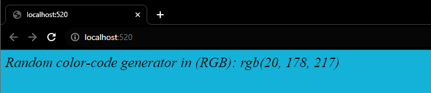
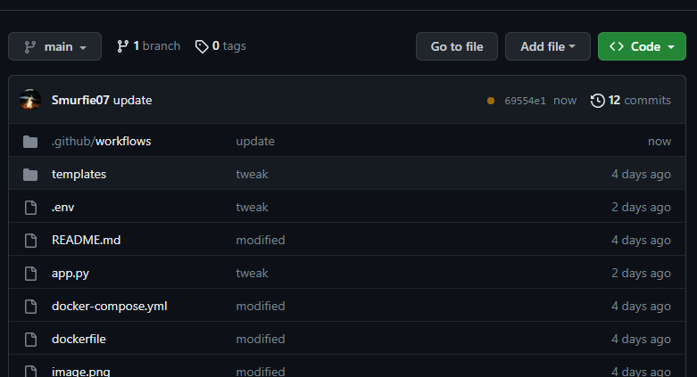
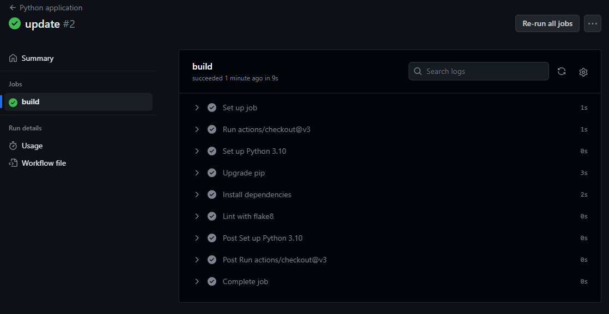
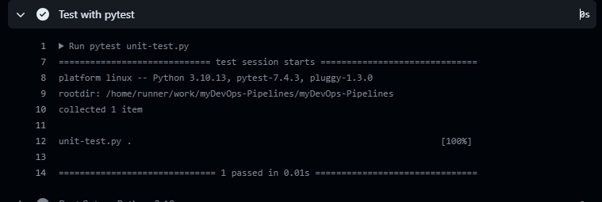
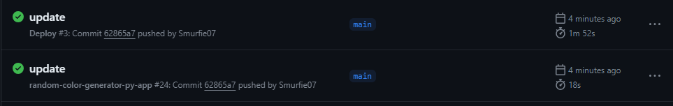
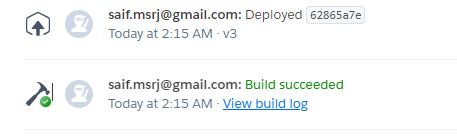

# myDevOps-Pipelines
## Github Actions Assignment

●	Create a Github repository for a simple web application using any web framework of your choice.

    //Random color-code generator app in rgb with dynamic reflection on page rendering every-time a application gets a new hit.

●	Create GH actions workflow. Your workflow must run on every push to the main branch and deploy the application to a cloud service (e.g., Heroku, Azure, AWS, or GCP). The workflow should have following jobs

        On pushing the pipelines runs successfully

    ○	Build: for building the application
        
        
    ○	Test: for testing the application (Run unit test)
        

    ○	Deploy: for deploying the application to a cloud service
        
        
    
●	Your workflow should use environment variables to store sensitive data, such as API keys or database credentials.
    Heroku API key stored in GH secrets.
    

●	Use public Github Actions runners.

    Used third party Deploy-to-Heroku GH action-workflow

    Repo link: https://github.com/Smurfie07/myDevOps-Pipelines.git
